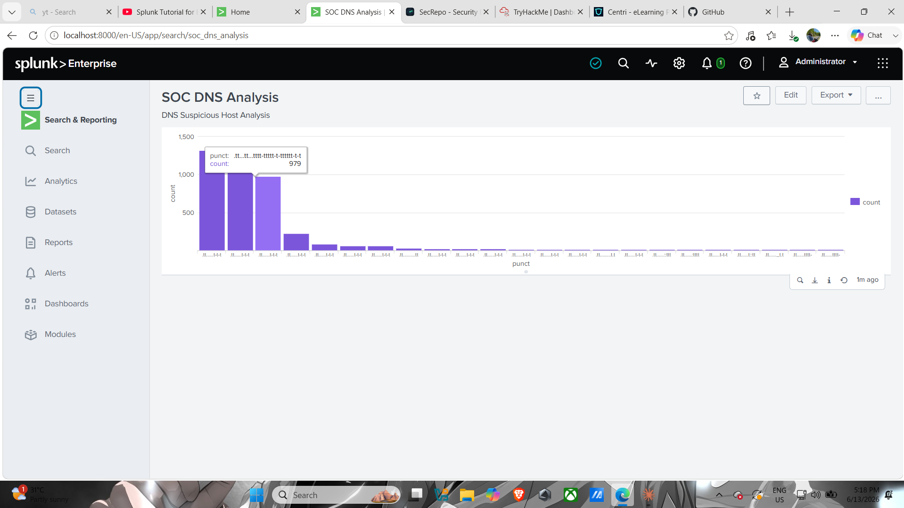

# 🔵 Splunk SOC Dashboard — DNS Threat Analysis

> A Security Operations Center (SOC) project using Splunk Enterprise to analyze real DNS network logs and detect suspicious activity using threat hunting techniques.

---

## 📋 Project Overview

This project demonstrates real-world SOC analyst skills by:
- Ingesting real network DNS logs into Splunk
- Performing threat hunting using SPL (Splunk Processing Language)
- Identifying suspicious hosts and DNS activity patterns
- Building a SOC security dashboard for visualization

---

## 🛠️ Tools Used


- **Splunk Enterprise** — SIEM platform for log analysis
- **DNS Logs** — Real network data from MACCDC2012 dataset (SecRepo.com)

---

## 📊 Dataset

- **Source:** SecRepo.com — MACCDC2012 Network Dataset
- **File:** `dns.log.gz`
- **Total Events:** 422,130 DNS events
- **Type:** Real network traffic including scanning, recon, and exploitation activity

---

## 🔍 Investigation Steps

### Step 1 — Ingested DNS Logs
Uploaded `dns.log.gz` into Splunk Enterprise and configured source type as `dns_logs`.

**Total events loaded:**
```
422,130 DNS events
```

---

### Step 2 — Searched for REFUSED DNS Queries
```spl
source="dns.log.gz" REFUSED
```
**Result: 1,767 REFUSED events detected** 🚨

**What is REFUSED?**
> When a computer tries to access a blocked or suspicious domain, the DNS server responds with **REFUSED** — meaning it won't answer the request.
> High number of REFUSED queries = possible malware trying to reach malicious domains!

---

### Step 3 — Identified All Suspicious IPs (Proper Approach)
Instead of guessing which IP is suspicious, we let the data tell us by listing ALL IPs with REFUSED queries:

```spl
source="dns.log.gz" REFUSED 
| rex field=_raw "(?P<src_ip>\d+\.\d+\.\d+\.\d+)" 
| stats count by src_ip 
| sort -count
```

**SPL Explanation:**
| Command | Meaning |
|---|---|
| `source="dns.log.gz" REFUSED` | Search for all REFUSED events in dns.log.gz |
| `rex field=_raw "(?P<src_ip>\d+\.\d+\.\d+\.\d+)"` | Extract IP addresses from raw log |
| `stats count by src_ip` | Count events per IP address |
| `sort -count` | Sort by highest count first |

**Result:**
| src_ip | count | Severity |
|---|---|---|
| **192.168.202.88** | **1,633** | 🔴 Most Suspicious |
| 192.168.202.110 | 55 | 🟡 Monitor |
| 192.168.202.81 | 32 | 🟡 Monitor |
| 192.168.202.138 | 12 | 🟢 Low |
| 192.168.202.140 | 11 | 🟢 Low |

**Finding:** 192.168.202.88 generated 1,633 REFUSED queries — far more than any other host! 🚨

---

### Step 4 — Analyzed DNS Patterns of Suspicious IP
```spl
source="dns.log.gz" 192.168.202.88 
| stats count by punct 
| sort -count
```

**SPL Explanation:**
| Command | Meaning |
|---|---|
| `192.168.202.88` | Filter events from suspicious IP only |
| `stats count by punct` | Group by punctuation pattern |
| `sort -count` | Show highest pattern count first |

**What is `punct`?**
> Splunk automatically removes all letters and numbers from log entries — leaving only the punctuation/symbols.
> This reveals the **structural pattern** of the log entry.
>
> **Normal computer** → varied patterns (different DNS queries)
> **Malware/Robot** → same pattern repeating (automated behavior!) 🚨

**Result:**
| Pattern | Count |
|---|---|
| `.tt...tt...tttt.-......-.ttttttttttt-t-t` | 1,320 🔴 |
| `.tt...tt...ttttttttttt-t-tttttt-t-t` | 1,211 🔴 |
| `.tt...tt...tttt-ttttt-t-tttttt-t-t` | 979 🔴 |

**Finding:** Same pattern repeating 1,320 times = **automated/malware behavior!**

---

### Step 5 — Built SOC Dashboard
Created visualization showing DNS pattern distribution for suspicious host and saved as **"SOC DNS Analysis"** dashboard in Splunk.

---

## 🚨 Findings & Conclusions

| Evidence | Finding | Severity |
|---|---|---|
| 1,633 REFUSED queries | Trying to access blocked/malicious domains | 🔴 High |
| Highest count among all IPs | Most suspicious host in network | 🔴 High |
| Same pattern repeating 1,320 times | Automated behavior — possible malware! | 🔴 High |

### Conclusion
> **192.168.202.88 is highly suspicious!**
> Evidence suggests this host is either:
> - 🦠 **Malware infected** — automatically trying to reach C2 servers
> - 👨‍💻 **Attacker** — performing network reconnaissance

### Recommended Actions (Real SOC Response)
```
1. Report findings to senior analyst
2. Isolate 192.168.202.88 from network
3. Investigate host for malware infection
4. Check if other hosts are affected
5. Write incident report
```

---

## 📸 Dashboard Screenshot



---

## 💡 Key Learnings

| Skill | Description |
|---|---|
| **Log Ingestion** | Uploading and indexing real logs in Splunk |
| **SPL Basics** | `source=`, `stats count`, `rex`, `sort` |
| **Threat Hunting** | Actively searching for suspicious activity |
| **IOC Identification** | Identifying suspicious IP — 192.168.202.88 |
| **Pattern Analysis** | Using `punct` to detect automated/malware behavior |
| **Dashboard Creation** | Visual representation of findings |

---

## 🗺️ Part of My SOC Analyst Journey

This project is **Phase 6** of my SOC Analyst roadmap:

```
Phase 1 — Linux Foundation           ✅ DONE
Phase 2 — Networking                 ✅ DONE
Phase 3 — Python Basics              ✅ DONE
Phase 4 — Cybersecurity Fundamentals ✅ DONE
Phase 5 — Wireshark + Log Analysis   ✅ DONE
Phase 6 — SIEM + Splunk              🔄 IN PROGRESS ← THIS PROJECT
Phase 7 — Portfolio + Resume         🔄 IN PROGRESS
```

---

*Part of my cybersecurity portfolio — github.com/leidsct*
